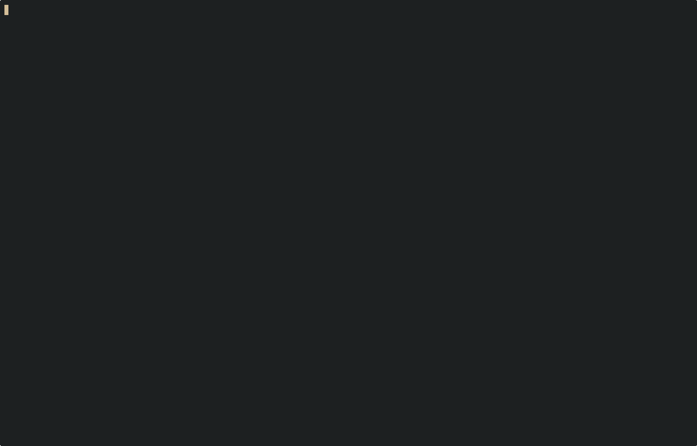

# Shqlite
terminal-based `sqlite` database client written in Rust. The interface of `shqlite` is inspired
by [litecli](https://litecli.com). We will gradually improve `shqlite` as time passes.



> [!WARNING]
> `shqlite` is not in a stable state. Most dot commands are not implemented and there may be other bugs that can occur.
> Feel free to submit a PR, your contribution is appreciated :pray:

# Depedencies
- `sqlite`
Ensure you have sqlite [version 3.34.1 or above](https://docs.rs/crate/rusqlite/0.38.0) installed in your system.

# Installation
```sh
# clone this repository
$ git clone https://github.com/sereinne/shqlite.git shqlite/
# go into the repo
$ cd shqlite/
# use `cargo` to build the app
$ cargo build --release
# run `shqlite`
$ ./target/release/shqlite --help
```
# Dot Commands Availability Table

> [!NOTE]
> :x: means unimplemented
> :white_check_mark: means implemented
> :warning: means partially implemented

| Commands     | Status             |
| --------     | ------------------ |
|.archive      | :x:                |
|.auth         | :x:                |
|.backup       | :white_check_mark: |
|.bail         | :x:                |
|.cd           | :x:                |
|.changes      | :x:                |
|.check        | :x:                |
|.clone        | :x:                |
|.connection   | :x:                |
|.crlf         | :x:                |
|.databases    | :white_check_mark: |
|.dbconfig     | :x:                |
|.dbinfo       | :x:                |
|.dbtotxt      | :x:                |
|.dump         | :x:                |
|.echo         | :white_check_mark: |
|.eqp          | :x:                |
|.excel        | :x:                |
|.exit         | :white_check_mark: |
|.expert       | :x:                |
|.explain      | :x:                |
|.filectrl     | :x:                |
|.fullschema   | :x:                |
|.headers      | :x:                |
|.help         | :white_check_mark: |
|.import       | :x:                |
|.imposter     | :x:                |
|.indexes      | :white_check_mark: |
|.intck        | :x:                |
|.limit        | :x:                |
|.lint         | :x:                |
|.load         | :x:                |
|.log          | :x:                |
|.mode         | :warning:          |
|.nonce        | :x:                |
|.nullvalue    | :x:                |
|.once         | :x:                |
|.open         | :white_check_mark: |
|.output       | :white_check_mark: |
|.parameter    | :x:                |
|.print        | :white_check_mark: |
|.progress     | :x:                |
|.prompt       | :x:                |
|.quit         | :white_check_mark: |
|.read         | :white_check_mark: |
|.recover      | :x:                |
|.restore      | :x:                |
|.save         | :white_check_mark: |
|.scanstats    | :x:                |
|.schema       | :white_check_mark: |
|.separator    | :x:                |
|.session      | :x:                |
|.sha3sum      | :x:                |
|.shell        | :white_check_mark: |
|.show         | :x:                |
|.stats        | :x:                |
|.system       | :white_check_mark: |
|.tables       | :white_check_mark: |
|.timeout      | :x:                |
|.timer        | :x:                |
|.trace        | :x:                |
|.unmodule     | :x:                |
|.version      | :white_check_mark: |
|.vfsinfo      | :x:                |
|.vfslist      | :x:                |
|.vfsname      | :x:                |
|.width        | :x:                |
|.www          | :x:                |
